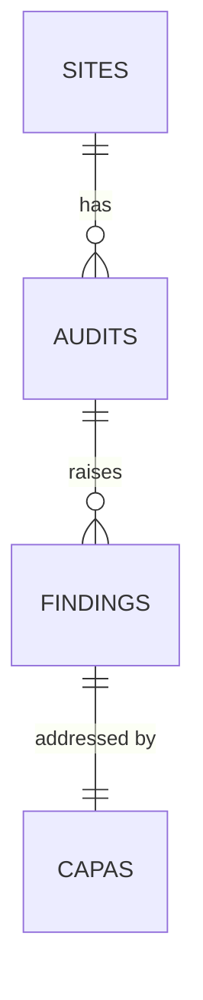

## 1. Overview
This is a synthetic dataset for **Meridian Pharma**, a fictional pharmaceutical
company with **5 manufacturing sites**. It covers audits conducted from
**2023-10-01 to 2026-09-30**.

All time-based calculations (open/overdue status, days open) use a fixed
**snapshot date of 2026-09-30**, so results don't change over time.

## 2. Data model
Tables are linked in a chain: sites → audits → findings → capas.

- Audit types: Internal, Corporate, and Regulatory. All audits are of the
  company's own sites; supplier audits are out of scope.

Each finding has exactly one CAPA. In practice, one CAPA can address
  several findings; this was simplified to keep the model clear.
## 3. Tables

Columns marked **derived** are not generated directly; they are calculated
from other columns (Phase 2 or Phase 3).

### 3.1 sites
One row per manufacturing site.

| Column | Type | Key | Description / allowed values |
|---|---|---|---|
| site_id | text | PK | S01–S05 |
| site_name | text | | Site location name |
| product_type | text | | Sterile Injectables, Oral Solid Dose, API |
| region | text | | North America, Europe, Asia |

### 3.2 audits
One row per audit conducted at a site.

| Column | Type | Key | Description / allowed values |
|---|---|---|---|
| audit_id | text | PK | A0001, A0002, … |
| site_id | text | FK → sites | Audited site |
| audit_date | date | | Between 2023-10-01 and 2026-09-30 |
| audit_type | text | | Internal, Corporate, Regulatory |
| auditor_org | text | | Site QA, Corporate QA, FDA, EMA, National Authority |

### 3.3 findings
One row per finding raised during an audit.

| Column | Type | Key | Description / allowed values |
|---|---|---|---|
| finding_id | text | PK | F00001, F00002, … |
| audit_id | text | FK → audits | Audit that raised the finding |
| process_area | text | | One of the six FDA inspection systems |
| category | text | | See Section 4 category table |
| cfr_reference | text | | 21 CFR 211 citation matching the category |
| severity | text | | Critical, Major, Minor |
| description | text | | Free-text finding statement |
| prior_occurrence_count | integer | derived | Prior findings of the same category at the same site within 730 days |
| is_recurrent | boolean | derived | True if prior_occurrence_count ≥ 1 |
| risk_score | number | derived | 0–100, calculated in Phase 3 |
| risk_tier | text | derived | High, Medium, Low |

### 3.4 capas
One row per CAPA. Each finding has exactly one CAPA.

| Column | Type | Key | Description / allowed values |
|---|---|---|---|
| capa_id | text | PK | C00001, C00002, … |
| finding_id | text | FK → findings | Finding this CAPA addresses (one-to-one) |
| open_date | date | | Within a few days of the audit date |
| due_date | date | | open_date + 30 / 60 / 90 days (Critical / Major / Minor) |
| close_date | date | | Blank if not yet closed |
| status | text | | Open, In Progress, Effectiveness Check Pending, Closed |
| effectiveness_check | text | | Not Yet Due, Pass, Fail |
| is_overdue | boolean | derived | See Section 5, business rules |
| days_open | integer | derived | (close_date, or snapshot date if open) − open_date |
