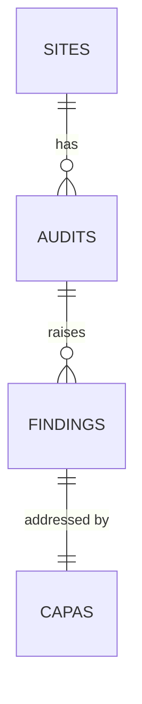

## 1. Overview
This is a synthetic dataset for **Meridian Pharma**, a fictional pharmaceutical
company with **5 manufacturing sites**. It covers audits conducted from
**2023-10-01 to 2026-09-30**.

All time-based calculations (open/overdue status, days open) use a fixed
**snapshot date of 2026-09-30**, so results don't change over time.

## 2. Data model
Tables are linked in a chain: sites → audits → findings → capas.

- Audit types: Internal, Corporate, and Regulatory. All audits are of the
  company's own sites; supplier audits are out of scope.

Each finding has exactly one CAPA. In practice, one CAPA can address
  several findings; this was simplified to keep the model clear.
## 3. Tables

Columns marked **derived** are not generated directly; they are calculated
from other columns (Phase 2 or Phase 3).

### 3.1 sites
One row per manufacturing site.

| Column | Type | Key | Description / allowed values |
|---|---|---|---|
| site_id | text | PK | S01–S05 |
| site_name | text | | Site location name |
| product_type | text | | Sterile Injectables, Oral Solid Dose, API |
| region | text | | North America, Europe, Asia |

### 3.2 audits
One row per audit conducted at a site.

| Column | Type | Key | Description / allowed values |
|---|---|---|---|
| audit_id | text | PK | A0001, A0002, … |
| site_id | text | FK → sites | Audited site |
| audit_date | date | | Between 2023-10-01 and 2026-09-30 |
| audit_type | text | | Internal, Corporate, Regulatory |
| auditor_org | text | | Site QA, Corporate QA, FDA, EMA, National Authority |

### 3.3 findings
One row per finding raised during an audit.

| Column | Type | Key | Description / allowed values |
|---|---|---|---|
| finding_id | text | PK | F00001, F00002, … |
| audit_id | text | FK → audits | Audit that raised the finding |
| process_area | text | | One of the six FDA inspection systems |
| category | text | | See Section 4 category table |
| cfr_reference | text | | 21 CFR 211 citation matching the category |
| severity | text | | Critical, Major, Minor |
| description | text | | Free-text finding statement |
| prior_occurrence_count | integer | derived | Prior findings of the same category at the same site within 730 days |
| is_recurrent | boolean | derived | True if prior_occurrence_count ≥ 1 |
| risk_score | number | derived | 0–100, calculated in Phase 3 |
| risk_tier | text | derived | High, Medium, Low |

### 3.4 capas
One row per CAPA. Each finding has exactly one CAPA.

| Column | Type | Key | Description / allowed values |
|---|---|---|---|
| capa_id | text | PK | C00001, C00002, … |
| finding_id | text | FK → findings | Finding this CAPA addresses (one-to-one) |
| open_date | date | | Within a few days of the audit date |
| due_date | date | | open_date + 30 / 60 / 90 days (Critical / Major / Minor) |
| close_date | date | | Blank if not yet closed |
| status | text | | Open, In Progress, Effectiveness Check Pending, Closed |
| effectiveness_check | text | | Not Yet Due, Pass, Fail |
| is_overdue | boolean | derived | See Section 5, business rules |
| closed_late | boolean | derived | See Section 5, business rules |
| days_open | integer | derived | (close_date, or snapshot date if open) − open_date |
## 4. Value definitions

### 4.1 Severity
Classification follows the EU GMP / PIC/S approach. EU inspectorates call the
lowest tier "Other"; this dataset uses "Minor," as many company audit programs do.

| Value | Definition |
|---|---|
| Critical | A deficiency that has caused, or creates a significant risk of causing, a product that could harm patients. |
| Major | A non-critical deficiency that has caused or could cause a product that does not meet its approved specifications or registration, or that shows a significant departure from GMP. Several related minor deficiencies can together be classified as major. |
| Minor | A departure from GMP that is neither critical nor major. |

Source: EMA, *Compilation of Union Procedures on Inspections and Exchange of Information*.

### 4.2 Process areas
Based on the six-system inspection model in FDA Compliance Program 7356.002.

| Value | What it covers |
|---|---|
| Quality System | Overall quality oversight: deviations, investigations, CAPA, change control, complaints, product reviews, and training |
| Facilities & Equipment | Buildings, utilities, environmental controls, and equipment cleaning, calibration, maintenance, and computerized systems |
| Materials | Receipt, testing, storage, and release of components, containers, and closures, including supplier qualification |
| Production | Manufacturing operations, batch records, in-process controls, and adherence to procedures |
| Packaging & Labeling | Label control and reconciliation, packaging operations, and line clearance |
| Laboratory Controls | Testing, method validation, stability programs, out-of-specification investigations, and lab records |

### 4.3 Finding categories
Each category belongs to exactly one process area and has a typical 21 CFR 211 citation.

| Process area | Category | CFR reference |
|---|---|---|
| Quality System | Inadequate deviation investigation | 211.192 |
| Quality System | Ineffective CAPA | 211.192 |
| Quality System | Change control deficiency | 211.100(a) |
| Quality System | Inadequate QC unit oversight | 211.22 |
| Quality System | Complaint handling deficiency | 211.198 |
| Quality System | Annual product review incomplete | 211.180(e) |
| Quality System | Training deficiency | 211.25 |
| Facilities & Equipment | Equipment cleaning / cleaning validation | 211.67 |
| Facilities & Equipment | Equipment calibration / maintenance | 211.68(a) |
| Facilities & Equipment | Facility maintenance | 211.58 |
| Facilities & Equipment | Environmental monitoring | 211.42(c) |
| Facilities & Equipment | Computerized system / data integrity | 211.68(b) |
| Materials | Component testing / supplier qualification | 211.84 |
| Materials | Material storage and handling | 211.80 |
| Production | Batch record documentation (GDP) | 211.188 |
| Production | Procedures not followed | 211.100(b) |
| Production | In-process control deficiency | 211.110 |
| Packaging & Labeling | Label control / reconciliation | 211.125 |
| Packaging & Labeling | Line clearance deficiency | 211.130 |
| Laboratory Controls | Inadequate OOS investigation | 211.192 |
| Laboratory Controls | Method validation deficiency | 211.165(e) |
| Laboratory Controls | Stability program deficiency | 211.166 |
| Laboratory Controls | Laboratory records / data integrity | 211.194 |
| Laboratory Controls | Lab instrument calibration | 211.160(b) |

### 4.4 Audit types

| audit_type | auditor_org | Description |
|---|---|---|
| Internal | Site QA | Self-inspection by the site's own quality team |
| Corporate | Corporate QA | Audit by the company's central quality group |
| Regulatory | FDA, EMA, National Authority | Inspection by a health authority |

### 4.5 CAPA status
Statuses move in this order: Open → In Progress → Effectiveness Check Pending → Closed.

| Value | Definition |
|---|---|
| Open | CAPA created; no actions started |
| In Progress | Corrective and preventive actions underway |
| Effectiveness Check Pending | Actions complete; waiting to verify they worked |
| Closed | Actions complete and effectiveness verified |

### 4.6 Effectiveness check

| Value | Definition |
|---|---|
| Not Yet Due | CAPA not yet closed |
| Pass | Verification showed the problem did not recur |
| Fail | Verification showed the actions did not resolve the problem |
## 5. Business rules

These rules define how dates, statuses, and derived columns are calculated.
All time-based rules use the **snapshot date (2026-09-30)**.

### 5.1 CAPA due date
Due date depends on finding severity (assumed company policy):

| Severity | Due date |
|---|---|
| Critical | open_date + 30 days |
| Major | open_date + 60 days |
| Minor | open_date + 90 days |

### 5.2 Overdue
`is_overdue` = True when **status is not Closed** and the snapshot date is
later than `due_date`. Otherwise False.

### 5.3 Closed late
`closed_late` = True when **status is Closed** and `close_date` is later
than `due_date`. Otherwise False.

### 5.4 Recurrence
A finding is **recurrent** when at least one finding with the **same category**
was raised at the **same site** in an audit dated within the **730 days before**
this finding's audit date.

- `prior_occurrence_count` = number of such earlier findings
- `is_recurrent` = True if `prior_occurrence_count` ≥ 1

### 5.5 Effectiveness check
Only CAPAs with status **Closed** can have an effectiveness check result of
**Pass** or **Fail**. All other CAPAs are **Not Yet Due**.

### 5.6 Status and close date consistency
- If status is **Closed**, `close_date` must be filled in.
- If status is anything else, `close_date` must be blank.

### 5.7 Date order
For every CAPA: `open_date` ≥ audit date, and `close_date` (if present) ≥
`open_date`. No date may be later than the snapshot date.

Rules 5.5–5.7 are also used as **data quality checks** after the synthetic
data is generated (Phase 2).
